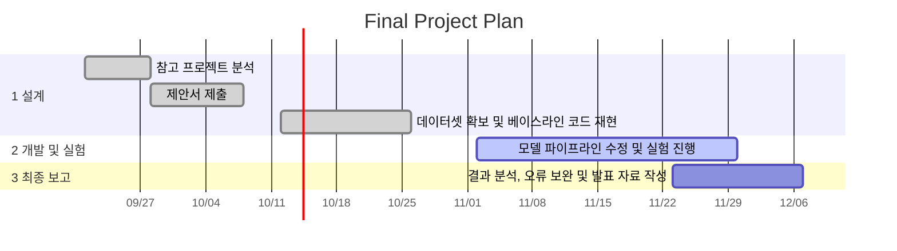

# 1. 프로젝트 개요

## 1.1. 기본 정보
- 프로젝트 제목 : 
-  작성일자 : 
-  학번 /이름 : 

# 2. 서론 및 배경

## 2.1. 배경
- 문제 정의 : 
- 제안 배경 : 

## 2.2. 기여점
- 참고 프로젝트 주제 : 
- 기존 프로젝트와의 차별성 :

# 3. 상세 내용

## 3.1. 개발 목표 및 접근법

- 정량적/정성적 달성 목표 : 
- 핵심 알고리즘 및 접근법 : 

## 3.2. 시스템 아키텍처

- 파이프라인 : (입력 -> 모델 처리 -> 출력 흐름으로 서술 & Figrue 첨부)

## 3.3. 입출력 인터페이스

-  입력 데이터 형태 : (ex - 640x640 RGB 단일 이미지 or Grayscale 영상)
-  최종 출력 형태 : (ex - 바운딩 박스 좌표 및 분류 클래스 ID)

# 4. 개발 환경

## 4.1. 데이터셋
- 데이터셋 이름 :
-  데이터셋 출처 : 
-  데이터 규모 : (샘플 수, 용량)
-  데이터 특징 : (클래스 구성, 라벨링 형태)

## 4.2. 실행 환경
- 개발 언어 및 프레임워크 : (ex - Python 3.10, PyTorch 2.x) 
-  라이브러리 : (ex - openCV, TorchVision 등)
-  연산 환경 : ( ex - Colab T4, 1x RTX 4090)

# 5. 수행 계획

## 5.1. 개발 일정
-  6~7주차 : (ex- 데이터셋 확보 및 베이스라인 코드 재현)
-  9~12주차 : (ex- 모델 파이프라인 수정 및 실험 진행)
-  12~14주차 : (ex- 결과 분석, 오류 보완 및 기말 발표 자료 작성)

# 6. 참고 문헌
- 논문 : 
-  오픈소스 저장소(Github URL) : 
-  기타 데이터셋 출처 URL : 